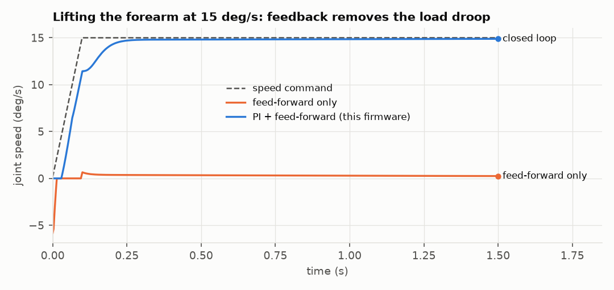
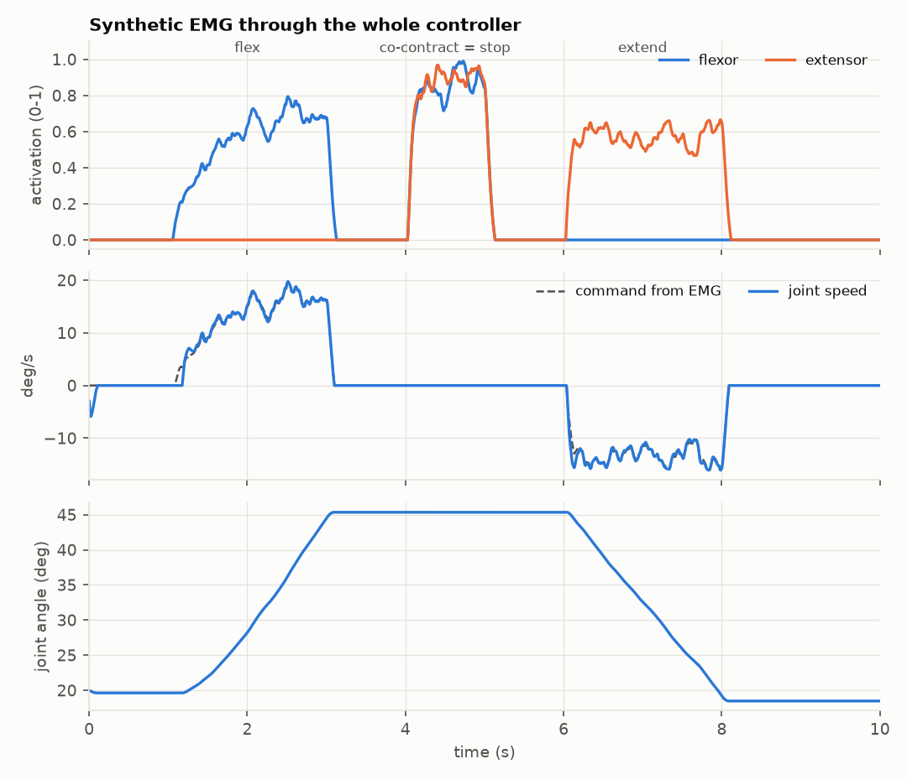
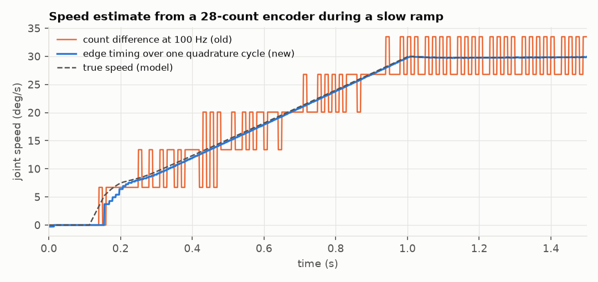

# Orthosis control firmware

This is the firmware for the EMG-driven arm orthosis: an ESP32-S3 on the v2 board, driving a goBILDA 5203 motor through a BTS7960.

Two muscles control the joint. The flexor drives it up, the extensor drives it down, and contracting both stops it. A PI velocity loop on the motor encoder makes the joint move at the speed you ask for, whatever the limb weighs, and holds it where it stops.

Every decision the firmware makes lives in [`emg_orthosis/orthosis_core.h`](emg_orthosis/orthosis_core.h), which has no hardware dependencies. That same file is compiled into [a simulator](sim/) of the motor, gearbox, ball screw, cable, pulley and forearm. The tests run the real controller against that model.

**Status:** designed and verified in simulation. It has not run on the board yet: the v2 PCB isn't fabricated. The numbers below are simulation results, and the bring-up procedure at the end is how they become hardware results.

```
make test       # 22 unit + closed-loop tests (host C++, GoogleTest)
make results    # traces, results/metrics.json, the figures below
```

CI ([`.github/workflows/firmware.yml`](../.github/workflows/firmware.yml)) runs the tests. It also compiles the sketch with the real Arduino-ESP32 3.x toolchain for the ESP32-S3.

## What changed from the first version, and why

| | Before | Now | Why |
|---|---|---|---|
| **Motor command** | EMG set PWM duty directly (open loop) | EMG sets a joint **speed**. A PI loop on the encoder drives the joint to it, with plant-inversion feed-forward. | Duty equals speed only with no load. Lifting a forearm at 15 °/s, feed-forward alone stalls (98% speed error), while the loop holds the error to 0.8%. |
| **Holding still** | Dynamic brake, which slows sag but can't stop it | The loop holds position at zero command | The integral of a speed error is a position error, so the PI is a position hold. Drift over 5 s against the limb in simulation: 0.000°. |
| **Speed measurement** | Encoder counts per 10 ms tick | Timing between encoder edges, over one full quadrature cycle | At 25 °/s the motor produces only 0.37 counts per ms. Counting per tick gives 12–111% error at arm speeds; edge timing gives under 0.02%. |
| **Speed limit** | Proportional back-off on duty ("governor") | The speed setpoint is capped, then acceleration-limited | The loop now tracks the setpoint, so capping it is the speed limit. |
| **Soft limits** | Stop commanding at the limit | A braking curve, v ≤ √(2·a·d) | The joint decelerates into the limit instead of arriving at speed: full speed into 30° stops at 29.54°. |
| **Envelope** | Two poles at 3 Hz, commented as "~55 ms" | Two poles at 4 Hz: **80 ms mean delay** (the old one was 106 ms) | Measured on 115 days of real forearm EMG through the v2 board model: 3 Hz cut ripple only 12% for 26 ms more delay. Most of the ripple is the muscle, not the filter. |
| **Encoder sign** | Unchecked | A runaway detector, plus `j` (identify) reports the sign | A reversed encoder turns a velocity loop into positive feedback. The detector catches it in 177 ms after 2.3° of travel. |
| **Watchdog** | A software check inside the same loop | The ESP-IDF hardware task watchdog, 200 ms, resets the chip | A reset releases every pin, and the board's pull-downs turn the driver off. A check in the loop it watches can't fire if that loop hangs. |
| **MOT_OK** | Read, only ever printed | Required to arm, and a fault if it drops | |
| **EMG lead-off / artefact** | Unchecked | A railed channel for 20 ms, or an envelope above 2× max contraction (MVC), is a fault | A detached electrode rails the in-amp, which the old code would have read as a full-speed command. |
| **Timing** | `loop()` with `micros()` polling, printing in the same loop | A 1 kHz FreeRTOS task pinned to core 1 (`xTaskDelayUntil`). Serial runs in a separate task. | Printing can never delay the control loop. Worst-case loop time and overruns are reported by `?`. |
| **Encoder ISR** | `digitalRead` plus a lookup table | Direct GPIO register reads, and a table-free Gray-code decode | Both are safe in an IRAM interrupt handler. |

## Control design

```
EMG x4 ──► DC track ─► rectify ─► 2-pole envelope (4 Hz) ─► activation (rest/MVC calibration, hysteresis)
                                                              │
                        flexor − extensor, dead zone, co-contraction = stop
                                                              ▼
                                     speed command (≤ 25 °/s)
                                                              ▼
                     accel limit (150 °/s²) ─► braking curve into the soft limits ─► ω_ref
                                                              ▼
       duty = (ω_ref + τ·dω_ref/dt)/K + d_f·sign(ω_ref)  +  Kp·e + Ki·∫e      e = ω_ref − ω
                                  feed-forward                    PI (anti-windup)
                                                              ▼
                                 BTS7960 ─► motor ─► 5.2:1 ─► 4 mm screw ─► cable ─► 47 mm pulley ─► joint
                                   ▲                                                                   │
                                   └──── ω from encoder edge timing (28 counts/rev at the motor) ◄──────┘
```

**Plant model.** A DC motor behind a stiff transmission is first order from duty to speed: ω/d = K/(τs + 1).
- **Gain:** K ≈ 187 °/s per unit duty at the joint. The goBILDA datasheet gives 12 V, 1150 RPM and 9.2 A stall, so R = 1.30 Ω and Ke = 0.0186 V·s/rad.
- **Time constant:** τ = J·R/(Kt·Ke) ≈ 20 ms, with the forearm's inertia reflected through the 192:1 overall ratio.
- **Measure both on your hardware:** `j` identifies K, friction and τ on the real motor.

**Feed-forward** inverts that model. The ω_ref/K term supplies the back-EMF voltage, and the τ·dω_ref/dt term supplies the torque to accelerate the inertia. With the model right, the joint follows the shaped setpoint with no lag. The PI then only has to reject what the model misses: limb weight, friction error and supply sag. Adding the acceleration term cut step overshoot from 14% to 9%.

**PI gains** use IMC tuning:
- Cancel the plant pole (Ti = τ) and place the closed loop at λ = 50 ms.
- That gives Kp = τ/(K·λ) and Ki = 1/(K·λ).
- Ki doubles as the holding stiffness: about 2 N·m of joint torque per degree of sag, from simulation.
- **Anti-windup:** the integrator stops accumulating while the output is saturated and the error would push it further.

**Total delay from muscle to motion** is about 80 ms (envelope) plus about 50 ms (loop time constant). That sits inside the ~100–150 ms myoelectric-control literature treats as acceptable.

## Simulation results

These come from `make test` and `make results`, with the nominal plant unless stated otherwise.



| Test | Result |
|---|---|
| Speed step 0 → 20 °/s with the forearm | 73 ms rise (10–90%), 8.9% overshoot, 0.21 °/s steady-state error |
| Lift / lower at ±15 °/s, feed-forward only | 98% / 56% speed error |
| Lift / lower at ±15 °/s, closed loop | 0.8% / 0.3% |
| Hold at zero command against gravity, 5 s | 0.000° drift |
| 2 N·m push on the forearm while moving at 10 °/s | Dips to 0 °/s, recovers to within 0.04 °/s |
| 36 plant variants: inertia ×0.3–3, 10.5–13.5 V, friction ×0.5–2, limb ×0.5–1.5 | All stable; worst overshoot 20.8%; steady-state error < 0.5 °/s |
| Full speed into the 30° soft limit | Stops at 29.54° (target 29.5°) |
| Obstruction inside the range | Stall fault 443 ms after contact, motor released |
| Encoder wired backwards | Runaway fault after 177 ms and 2.3° of travel |
| Kill switch opened / MOT_OK dropped / electrode lead off | Coasts that tick / fault that tick / fault within 20 ms |
| Arming without calibration, zero, closed kill switch or MOT_OK | Refused, with the reason |
| Identify (`j`) on the model | K 192 (true 193) °/s/duty; τ 28 ms (true 22; stiction delays the rise); reversed encoder reported |
| EMG end to end (below) | Flex +25.9°, co-contraction 0.00°, extend −26.1°, relaxed hold within 1° |





**What the model leaves out.** Current isn't modelled dynamically: the motor's L/R is under 1 ms, well below the 1 ms tick. The cable is treated as stiff. The ESP32 ADC is treated as linear, and the synthetic EMG is Gaussian noise with a controlled amplitude. The limb and rotor inertia are estimates, which is why the robustness sweep exists. Real numbers come from the bench.

## Bring-up, in this order

**Setup**
1. Arduino IDE: **esp32 by Espressif, 3.x**. Board: ESP32S3 Dev Module. Tools → **USB CDC On Boot: Enabled**.
2. Wire J4 pin 8 (MOT_OK) to something meaningful. At minimum, tie it to MOT_5V through the harness so it means "motor side powered". The firmware won't arm while it reads LOW.

**Motor only: no limb, joint free**
3. Power the motor supply with the kill switch open. `?` should show `kill=OPEN` and `driver=ok`.
4. `m`, then turn the gearbox output 10 revolutions by hand, then `?`. Counts / 28 / 10 is the gear ratio. Set `gear_ratio` if it isn't 5.2.
5. Hand-move the joint to its lower limit and press `z`. Then move it to mid-range, close the kill switch, and press `j`.
   - It reports the encoder sign, K, friction and τ.
   - Paste the values into `makeConfig()`. If the sign is reversed, set `encoder_sign = -1`.

**Loop, still with no limb**
6. `c` to calibrate, then `a` to arm. Contract gently and watch `s` telemetry: `ref` and `vel` should agree.
7. Open the kill switch while it's moving: it must coast immediately.
8. `?` shows the worst-case loop time. It should be well under 1000 µs.

**With the limb** — only after everything above passes
9. Keep `joint_max_deg` at 30. Widen the range 10° at a time.

## Files

```
emg_orthosis/emg_orthosis.ino    hardware layer: pins, ADC, PWM, encoder ISR, 1 kHz task, watchdog, serial
emg_orthosis/orthosis_core.h     everything that decides what the motor does (portable C++17)
emg_orthosis/telemetry.h         snapshot the control task publishes for the serial task
sim/plant.h                      motor + transmission + forearm + imperfect encoder
sim/harness.h                    runs the real Controller against the plant at 1 kHz
sim/test_core.cpp                unit tests: decoder, estimator, envelope, activation, shaper, PI
sim/test_closed_loop.cpp         closed-loop, robustness, safety and end-to-end tests
sim/demo.cpp, sim/plot.py        results/metrics.json, traces and figures
sim/arduino_stub/, sketch_check  compiles the .ino as C++ on a laptop
```
