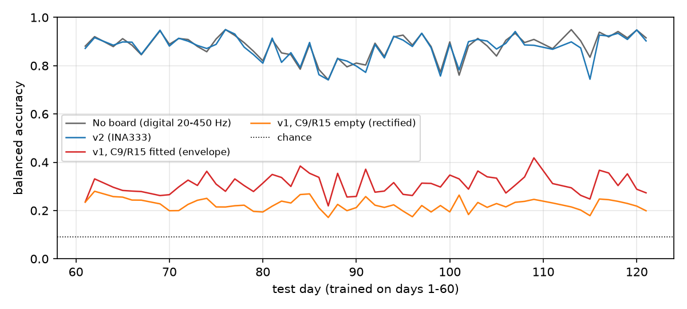
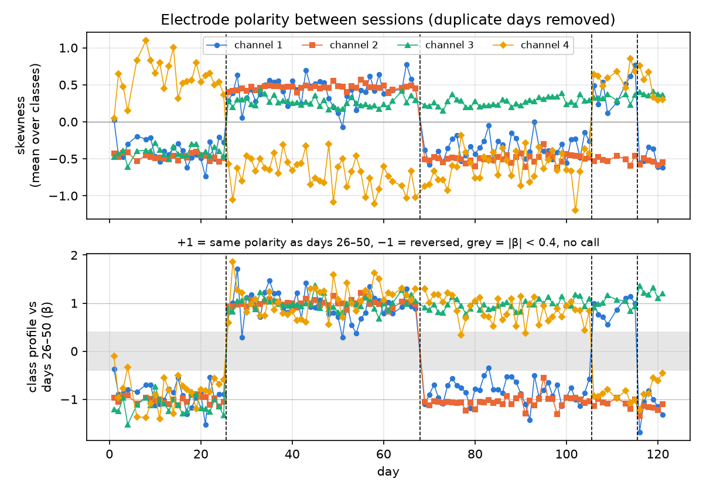
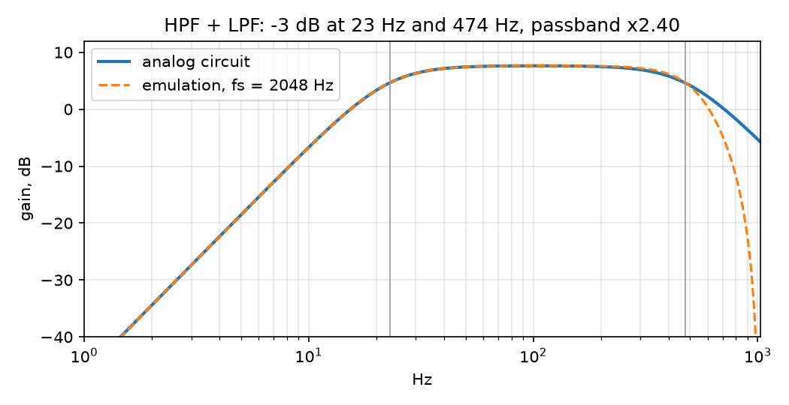
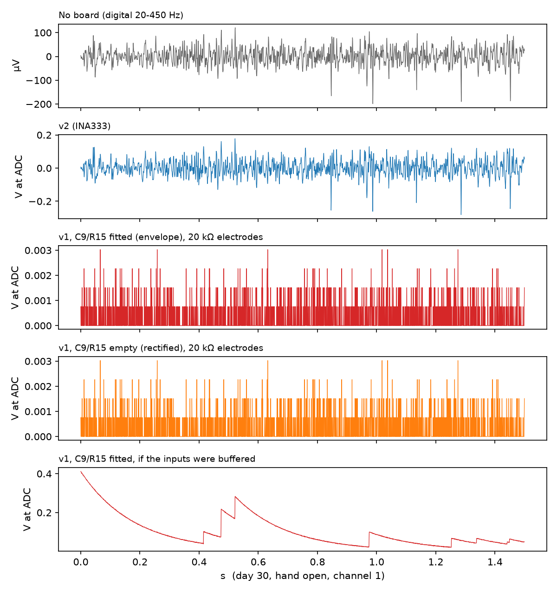
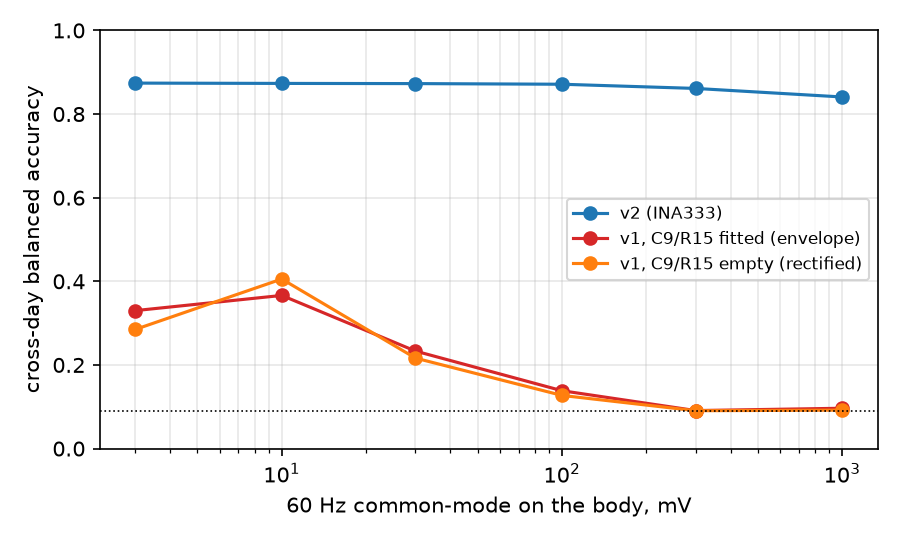
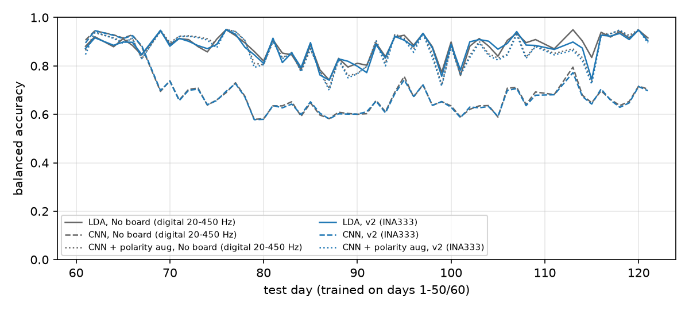

# Orthosis EMG decoder: what the v1 and v2 boards can actually decode

The orthosis has two EMG front-end designs: v1, which was fabricated, and v2, the redesign. Neither board
has recorded a person yet. This project asks what each board would let a gesture decoder do. It runs
**real multi-day surface EMG** through a sample-level emulation of each board's analog chain and ADC, trains
the same decoders on what comes out, and scores them on days the model has never seen.

This is written as an engineering note: what the emulation assumes, where it holds, where it doesn't, and
what's next. The bugs found along the way are in [`DEBUG_LOG.md`](DEBUG_LOG.md).



## Every number, and where it comes from

| Quantity | Value | Regenerate | Evidence |
|---|---|---|---|
| Cross-day LDA, **v2 board**, 11 classes, mean over 57 test days | **87.3 %** (± 5.3) | `make lda` | [`lda.json`](results/lda.json) → `main/v2@0.0/cross_day`, [figure](results/figures/cross_day.png) |
| Same, no board (clean digital 20–450 Hz band-pass) | 87.9 % (± 5.1) | `make lda` | `lda.json` → `main/reference@0.0` |
| Same, v1 with C9/R15 fitted / left empty | 30.8 % / 22.3 % | `make lda` | `lda.json` → `main/v1_envelope@0.0`, `main/v1_raw@0.0` |
| v2 with 100 mV of 60 Hz on the body / with 1 V | 87.1 % / 84.1 % | `make lda` | `lda.json` → `main/v2@0.1`, `sweeps/v2@1.0@20000.0` |
| Shuffled-window split, v2 (leaky; don't quote) | 91.3 % | `make lda` | `lda.json` → `main/v2@0.0/random_split` |
| CNN on raw windows, v2: plain / + gain aug / + polarity aug (3 seeds) | 68.2 / 60.6 / **86.3 %** | `make cnn` | [`cnn.json`](results/cnn.json), [figure](results/figures/cnn_vs_lda.png) |
| LDA trained on exactly the CNN's windows | 86.8 % | `make cnn` | [`lda_control.json`](results/lda_control.json) |
| v2 sampled at the firmware's 1 kHz instead of 2048 Hz | 86.9 % | `make rate` | [`sample_rate.json`](results/sample_rate.json) |
| Filter −3 dB corners, passband gain | 23.0 Hz and 473.9 Hz, × 2.41 | `make board` | [`board.json`](results/board.json), [figure](results/figures/filter_response.png) |
| Digital emulation vs analog circuit, below 400 Hz | within 0.38 dB | `make board` | `board.json` → `max_digital_vs_analog_error_db_below_400hz` |
| v1 stage-1 gain and CMRR with 20 kΩ electrodes | 2.45 (ideal 47), 22.6 dB | `make board` | `board.json` → `v1_front_end_vs_electrode_impedance` |
| v2 effective CMRR, right-leg drive included | 116.1 dB | `make board` | `board.json` → `v2` |
| Usable days after dropping byte-identical copies | 115 (58 train, 57 test) | `make audit` | [`data_audit.json`](results/data_audit.json) |
| Test days whose electrode-polarity pattern never occurs in training | 51 of 57 (every day from 69 on) | `make audit` | `data_audit.json` → `polarity`, [figure](results/figures/polarity.png) |
| Full LDA run (every protocol, both sweeps) | 250 s on 4 cores; `lda.json` reproduced byte-for-byte | `make lda` | — |

Every random draw is seeded from (day, class, purpose), so everything here is deterministic. `make claims`
compares every number the résumé and portfolio page state about this project against these files and exits
non-zero on a mismatch ([`claims.json`](claims.json)). The full table set is in
[`results/summary.md`](results/summary.md), regenerated by `make report`.

**Metric:** balanced accuracy (mean per-class recall) over 11 classes, so chance is 1/11 = 9.1 %. It is
computed separately for each test day, and the table gives the mean ± SD over the 57 test days. Train on
days ≤ 60, test on each day > 60, never recalibrated. Single subject throughout.

## Build and run

`lda.json` was reproduced byte-for-byte on 2026-10-05 with Python 3.11, numpy 2.4.6, scipy 1.17.1,
scikit-learn 1.9.1, numba 0.68.0 and matplotlib 3.11.2. The torch version behind `cnn.json` wasn't recorded.

```bash
make setup     # pip install -r requirements.txt
make data      #          ~2 GB git clone of LibEMG/MultiDay into data/multiday (or set MULTIDAY_DIR)
make test      #          8 tests: filter corners, v1 dead zone and loading, v2 linearity, aliasing, ZC count
make board     #          filter and front-end numbers; needs no data
make audit     # ~30 s    duplicate days, electrode polarity changes, RMS across each change
make lda       # ~5 min   every LDA protocol and both sweeps, 4 cores
make cnn       # ~25 min  8 CNN variants × 3 seeds (17 min of training) + the matched LDA control
make rate      # <1 min   v2 at the firmware's 1 kHz ADC rate
make report    #          results/summary.md and figures
make claims    #          résumé and portfolio numbers vs results/*.json
make all       #          all of the above, in order
```

## The data

**Dataset.** [LibEMG MultiDay](https://github.com/LibEMG/MultiDay) (Kaufmann, Englehart & Platzner,
"Fluctuating EMG signals: investigating long-term effects of pattern matching algorithms", IEEE EMBC 2010):
* 1 subject, 121 recording days, 4 bipolar surface-EMG channels at 2048 Hz.
* 11 classes: no motion, wrist extension, flexion, adduction, abduction, supination, pronation, hand open,
  hand closed, key grip, index point.
* One sustained contraction of about 6 s per class per day; no transitions.
* Files `S0_D{day}_C{class}.csv`. Values are taken as µV (the NeXus amplifier's unit). The dataset doesn't
  say, but the amplitudes, 30–300 µV RMS, fit.

**Why this dataset.** It has the board's channel count, and it spans 121 days where Ninapro DB6 spans 5.
Ninapro and PhysioNet sit behind a registration wall that wasn't reachable where this was built.
[`emgdec/data.py`](emgdec/data.py) is the only file that would change to run on them.

### Byte-identical days

`make audit` hashes each day's 11 files. Days **5/7, 63/68 and 110/112** are the same bytes under two day
numbers. Real EMG is a stochastic interference pattern, so two sessions can't match sample for sample: these
are copies. Which number is the real one can't be known, so all six days are dropped, leaving 115: 58 train
(≤ 60) and 57 test (> 60).

No pair straddles day 60, so the copies never put training data in the test set. They did double-weight
two test days, and they turned one point of the days-elapsed curve into a self-test: a model trained on a
block containing day 63 was "tested" on day 68 (DEBUG_LOG #2).

### Electrode polarity changes between sessions

A lead clipped on backwards negates its channel, x → −x. Two statistics separate that from other changes:

```
skewness  γ(x) = E[(x − μ)³] / σ³      odd:   γ(−x) = −γ(x)     scale-free: γ(gx) = γ(x)
RMS       r(x) = √E[x²]                even:  r(−x) = r(x)      scales:     r(gx) = g·r(x)

lead reversed      → γ flips, RMS unchanged
gain changed       → γ unchanged, RMS scales
electrode moved    → both change, unpredictably
```

EMG has a consistent skew sign at all because, under a fixed electrode pair, motor-unit potentials aren't
symmetric. Their shape depends on where the pair sits relative to the innervation zone and fibre direction.

**The test.** Each day gives 11 per-class skewness values per channel. A reversal predicts that the whole
11-class profile flips at roughly the same size. So each day's profile is regressed, with no intercept, on
that channel's mean profile over days 26–50:

```
β_d = (s_d · s_ref) / (s_ref · s_ref)      s = 11 per-class skewness values for one channel

β ≈ +1  same polarity as days 26–50       β ≈ −1  reversed       |β| < 0.4  no call
```

Across all 460 day-channels |β| has a median of 0.99. Nine calls fall below 0.4, and none disagrees with
the days around it. The result is five clean segments:

| Days | Ch 1–4 vs days 26–50 | In training? |
|---|---|---|
| 1–25 | `− − − −` | yes |
| 26–67 | `+ + + +` | yes (61–67 are test days) |
| 69–105 | `− − + +` | **no** |
| 106–115 | `+ − + −` | **no** |
| 116–121 | `− − + −` | **no** |

Day 68 is one of the duplicates, so the third change happened on day 68 or 69. From day 69 on, every test
day has a polarity pattern that never occurs in days 1–60.

**The RMS check.** Mean RMS over the 5 kept days after each change, divided by the 5 before:

| Change at day | Channels that flip | RMS ratio, flipped | RMS ratio, all four |
|---|---|---|---|
| 26 | 1, 2, 3, 4 | 0.99, 0.90, 0.92, 0.94 | same |
| 69 | 1, 2 | 0.92, 0.99 | 0.92, 0.99, 1.04, 0.99 |
| 106 | 1, 4 | 1.11, 1.18 | 1.11, 1.07, 1.12, 1.18 |
| 116 | 1 | 1.04 | 1.04, 0.97, 1.05, 0.86 |

Where nothing changes, the same ratio has a 5th–95th percentile range of 0.94–1.11. So RMS moves a little at
each change (at most 18 %), and the channels that didn't flip move by similar amounts. That points to
electrodes being re-applied with leads swapped, not to a channel moving onto another muscle. It is an
inference: the dataset authors don't document the reversals, and an amplifier configuration change would
look the same to the decoders.



The top panel is the old test, the sign of the class-averaged skewness. It also put one-day "changes" on
days 1 and 51 that were channels sitting near zero (DEBUG_LOG #5).

Hudgins features are sign-invariant, so LDA never notices any of this. A CNN on raw waveforms does (E3).
The reversals are left uncorrected on purpose: a real orthosis will get a lead clipped on backwards too.

## The signal chains

The v2 values are read off [`../orthosis_v2_schematic.pdf`](../orthosis_v2_schematic.pdf). The v1
schematic source (`openeremg.kicad_sch`) isn't in this repo; its values are as transcribed in
[`emgdec/board.py`](emgdec/board.py).

| Stage | v1 (fabricated) | v2 (redesign) |
|---|---|---|
| Input | Electrodes drive the 1k resistors of the difference amp directly | R19/R20 10k in series, into the INA333 (100 GΩ) |
| Stage 1 | LM324 difference amp, 1k/47k: G = 47 ideal, **2.45 with 20 kΩ electrodes** | INA333, G = 1 + 100k/R_G, R_G = R21 + R22 = 2 × 5.49k → 10.1 |
| HPF | Sallen-Key 15k/470n, K = 1 + 10k/18k = 1.556, Q = 0.69 | same |
| LPF | Sallen-Key 1k/330n, same K and Q | same |
| Gain | 1 + (47k + 0–100k pot)/1k = 48–148 | 1 + (10k + RV1 0–100k)/1k = 11–111 |
| Output | SS14 half-wave (0.4 V drop), then C9 10 µF ∥ R15 18k (τ = 180 ms), or C9/R15 empty | R33 1k / C24 33n (4.8 kHz) into the ADC, centred on VREF = 1.65 V |
| Supply | ±3.3 V (ICL7660); the LM324 can't swing above about +1.8 V | single 3.3 V, MCP6004 rail-to-rail |
| Common-mode | resistor matching (~62 dB) and electrode imbalance (below) | INA333 100 dB min, plus a right-leg drive |
| ADC | ESP32-S3, 12-bit, about 10 effective bits | same |

`make board` checks the analog numbers without any data, and `tests/` pins them.

### The filter band, derived

Both boards use equal-component, non-inverting Sallen-Key stages:

```
H_HP(s) = K·s² / (s² + (ω0/Q)·s + ω0²)          H_LP(s) = K·ω0² / (s² + (ω0/Q)·s + ω0²)

general LP denominator:  s² + s·(1/R1C1 + 1/R2C1 + (1 − K)/R2C2) + 1/(R1R2C1C2)
with R1 = R2 = R, C1 = C2 = C:  s² + s·(3 − K)/RC + 1/(RC)²

ω0 = 1/RC     Q = 1/(3 − K)     K = 1 + 10k/18k = 1.556   →   Q = 0.692
HPF 15k / 470n:  f0 = 22.58 Hz        LPF 1k / 330n:  f0 = 482.3 Hz        |H(jω0)| = K·Q = 1.077
```

* **One stage's −3 dB point.** Set |H|² = K²/2 with Ω = f/f0. For the high-pass that gives
  Ω⁴ + (2 − 1/Q²)·Ω² − 1 = 0, so Ω² = 1.0442 and Ω = 1.0218. Alone, the HPF is −3 dB at 23.07 Hz and the
  LPF (by symmetry) at 482.3/1.0218 = 471.98 Hz. With Q just under 1/√2, each corner sits slightly inside f0.
* **The cascade.** The two f0 are only 4.4 octaves apart and their skirts overlap. Mid-band each stage is at
  99.7 % of K, so the cascade peaks at **2.405** (+7.6 dB), not K² = 2.420. Measured from that peak, the
  corners move out a little, to **23.0 Hz and 473.9 Hz**.
* **Not quite Butterworth.** Q = 1/√2 needs K = 3 − √2 = 1.586, i.e. 17.07k where the board has 18k, the
  nearest standard value. That gives Q = 0.692, very slightly overdamped.

**Discretisation.** Each stage goes through the bilinear transform at 2048 Hz, pre-warped so f0 lands exactly:

```
s ← 2·fs·(1 − z⁻¹)/(1 + z⁻¹)            ω0' = 2·fs·tan(π·f0/fs)

HPF: ω0 moves by 0.04 %        LPF: 3030 → 3739 rad/s (+23 %)
max |digital − analog|:  0.08 dB below 200 Hz,  0.27 dB below 300 Hz,  0.38 dB below 400 Hz
```

Bilinear maps the whole jΩ axis onto the unit circle once, so nothing aliases and stable stays stable.
Pre-warping pins f0, but the shape around it still follows the tan mapping, which compresses toward Nyquist.
Impulse invariance would alias, and it can't realise a high-pass at all. Filters run through causal
`lfilter`, and every stage clips at the op-amp swing.



### Why v1 fails: the electrodes load the difference amp

The 1k input resistors sit in series with the skin-electrode impedance:

```
Vout = a·E+ − b·E−      a = R2/(R1 + Z+ + R2) · (1 + R2/(R1 + Z−))      b = R2/(R1 + Z−)
G_diff = (a + b)/2      G_cm = a − b      CMRR = G_diff / |G_cm|

Z± = 0:                         a = b = 47 → G_diff = 47, G_cm = 0
Z+ = 22.5k, Z− = 17.5k (20 kΩ ± 25 %):  b = 2.54, a = 2.36 → G_diff = 2.45, G_cm = −0.180 → 22.7 dB
```

With the 62 dB resistor-matching limit (1 % parts: (1 + G)/(4·tol) ≈ 1200) added in, that's 22.6 dB. The
inverting input presents only R1 = 1 kΩ. A tens-of-kΩ electrode in series with it divides down the gain,
and any imbalance between Z+ and Z− unbalances the bridge whose balance *is* the CMRR.

| Electrode impedance | v1 stage-1 gain | v1 CMRR | Input needed to clear the SS14 at max pot |
|---|---|---|---|
| 0 (buffered) | 47 | 62 dB | 24 µV |
| 5 kΩ | 8.6 | 32 dB | 129 µV |
| 20 kΩ (default) | 2.45 | 23 dB | 456 µV |
| 50 kΩ | 0.99 | 18 dB | 1.1 mV |

The table assumes a 25 % mismatch between the two electrodes. Surface EMG is typically 50 µV to 1 mV at the skin.

**Then the rectifier.** The SS14 and C9 ∥ R15 form a peak detector:

```
e[n] = max( e[n−1]·exp(−1/(fs·τ)),  v[n] − 0.4 V )        τ = C9·R15 = 10 µF × 18 kΩ = 180 ms
```

It charges instantly through the diode and bleeds through R15. Its bandwidth is about 1/(2πτ) ≈ 0.9 Hz,
so it barely moves within a decision window, and anything below 0.4 V comes out as zero. After calibration
every v1 pot is at its 100 kΩ limit, and only **0.22 %** of samples ever clear the diode. What reaches the
ADC is mostly its own noise. The output is never negative, so zero crossings are always zero, and 4 of the
16 features are dead.

The impedance sweep separates two causes:
1. **Unbuffered 1k inputs.** Buffered, v1 reaches 59.5 % (envelope) or 71.4 % (rectified). The unbuffered
   input costs it 29–49 points.
2. **Rectification itself.** Those 59.5–71.4 % are still 16–28 points below v2. Rectifying throws away the
   negative half-wave and all waveform shape under 0.4 V, and the envelope throws away everything faster
   than about 1 Hz. Buffers fix the first cause; only removing the rectifier fixes the second.

v1 with C9/R15 empty is modelled optimistically: it assumes the ADC discharges the node every sample, while
on the real board the node floats.



### Why v2 passes: 100 GΩ inputs and a right-leg drive

With 100 GΩ inputs, electrode impedance can't divide the gain. Common-mode reaches the differential path
in two ways: the INA's own CMRR, and electrode imbalance against its 3 pF common-mode input capacitance (the
potential-divider effect). The right-leg drive then shrinks the common-mode on the body:

```
Vdiff / Vcm = (10^(−100/20) + |Z+ − Z−| / Zcm) · 10^(−20/20)       Zcm = 1/(2π·60 Hz·3 pF) = 884 MΩ

5 kΩ imbalance: 5k / 884M = 5.7e−6 (−105 dB)  →  96.1 dB with the INA  →  116.1 dB with the RLD
```

At 116 dB, 1 V of body common-mode becomes 1.6 µV of differential signal, against EMG of 30–300 µV RMS.

On the schematic, the INA333's gain resistor is split into two 5.49k halves. Their midpoint sits at the
input common-mode voltage, and U3B inverts it with gain −20 (R16 200k / R10 10k, rolled off by C12 above
~800 Hz). The result drives the reference electrode through R17 390k. G = 10 in the first stage keeps
electrode DC offsets of up to about ±150 mV inside the ±1.6 V swing before C19 AC-couples them away.

### The rest of the chain

* **Bench calibration** (`calibrate_pots`). On days 1–5 only, each channel's pot is set to the smallest gain
  that puts the 99.9th percentile of |output| at 1.6 V (v1) or 1.2 V (v2), clamped to 0–100 kΩ. v2 lands at
  47k / 93k / 100k / 100k. v1 hits the limit on every channel.
* **ADC.** Gaussian noise sized for 10 effective bits (σ = 0.87 mV), clipped to 0–3.1 V, rounded to 12-bit
  codes (LSB 0.76 mV). The v2 output is offset by VREF before the ADC and has it removed after, as the
  firmware does.
* **Mains hum.** 60 Hz, scaled by each board's common-mode-to-differential ratio. Its level is drawn per
  *day* (× 0.5–1.5) and its phase per recording, and the same waveform goes on all four channels. Drawn per
  recording, hum level becomes a class fingerprint (DEBUG_LOG #1).
* **0.5 s trim.** The first 0.5 s of every recording is dropped. The HPF settles in ~50 ms (its pole time
  constant is 2Q/ω0 = 9.8 ms), but anything the v1 peak detector catches at start-up decays with τ = 180 ms;
  after 0.5 s, e^(−0.5/0.18) = 6 % is left.
* **Windows.** 400 samples (195 ms) every 100 (49 ms): 75 % overlap, a decision every 49 ms. Window length
  and step are fixed in seconds, so at 1 kHz they are 195 and 49 samples.

## Features

The Hudgins set, per channel, on one window x₁…x_N (N = 400) with Δᵢ = xᵢ₊₁ − xᵢ:

```
logMAV = ln( (1/N)·Σ|xᵢ| )                                  amplitude; = σ·√(2/π) for Gaussian EMG
logWL  = ln( Σ|Δᵢ| )                                         amplitude × bandwidth, ≈ σ·f_rms
ZC     = Σ 1[ xᵢ·xᵢ₊₁ < 0  and  |Δᵢ| ≥ ε ]                   ≈ 2T·√(m2/m0): RMS frequency (Rice)
SSC    = Σ 1[ Δᵢ·Δᵢ₊₁ < 0  and  (|Δᵢ| ≥ ε or |Δᵢ₊₁| ≥ ε) ]   ≈ 2T·√(m4/m2): rate of local extrema

ε (per channel) = 0.05 × RMS of that channel's output on days 1–5        m_n = ∫ fⁿ·S(f) df
```

4 features × 4 channels = 16. `StandardScaler` z-scores them inside the LDA pipeline, fit on training rows only.

| Feature | Gain x → g·x | Polarity x → −x |
|---|---|---|
| logMAV, logWL | shift by ln g | invariant |
| ZC, SSC | change only through the fixed ε | invariant |

* **Why logs.** A gain change becomes a constant offset. And since MAV ∝ σ and WL ∝ σ·f_rms,
  logWL − logMAV ≈ ln f_rms is a gain-free frequency measure that a linear classifier can form directly.
* **Why sign doesn't matter.** Every feature is built from |x|, |Δ| or a product of two neighbours, all even
  functions. That's why LDA is blind to the polarity changes.
* **Cost.** Each feature updates per sample with a running sum: a handful of operations per sample per
  channel, on the order of 10⁵ simple operations per second for 4 channels at 2048 Hz.

## Decoders

### LDA

```
p(x | class k) = N(μ_k, Σ)                    one covariance shared by all classes
δ_k(x) = xᵀΣ⁻¹μ_k − ½·μ_kᵀΣ⁻¹μ_k + ln π_k     predict argmax_k δ_k(x)

Ledoit–Wolf:  Σ = (1 − α)·S + α·(tr S / p)·I     α = min(1, b²/d²)
              d² = ‖S − (tr S/p)·I‖²_F            b² = (1/n²)·Σᵢ ‖xᵢxᵢᵀ − S‖²_F
```

scikit-learn's `solver="lsqr", shrinkage="auto"` shrinks each class's covariance this way, averages them by
prior, and solves for the coefficients by least squares. With ~74,000 training windows and 16 features, α
is close to zero for v2. Shrinkage matters for v1, where the ZC columns are constant and S is singular, and
for fresh-only recalibration, where 0.25 s per class is 22 windows in 16 dimensions. A decision costs
11 × 16 multiply-adds.

### 1D CNN (EMGNet)

| Layer | Output | Parameters |
|---|---|---|
| input | (B, 4, 400) | |
| Conv1d 4→32, k = 9, pad 4 · BatchNorm · ReLU · MaxPool 2 | (B, 32, 200) | 1,184 + 64 |
| Conv1d 32→64, k = 7, pad 3 · BatchNorm · ReLU · MaxPool 2 | (B, 64, 100) | 14,400 + 128 |
| Conv1d 64→64, k = 5, pad 2 · BatchNorm · ReLU | (B, 64, 100) | 20,544 + 128 |
| global average pool · Dropout 0.3 · Linear 64→11 | (B, 11) | 715 |
| **total** | | **37,163** |

All convolutions have stride 1. The receptive field before the global pool is 40 samples (20 ms), so the
network is 64 learned non-linear detectors averaged over the window: a learned version of MAV and WL,
except that nothing forces its detectors to ignore sign. It costs about 5.4 M multiply-adds per window.

**Training** (`train_cnn`, `run_cnn.py`):
* Train on days 1–50, every 4th window (non-overlapping, about 15,000). Each channel is divided by its
  training-set SD.
* Class-weighted cross-entropy, AdamW (lr 1e-3, weight decay 1e-4), batch 256, cosine annealing.
* **8 epochs**, scored on held-out days 51–60 after each one; the best epoch's weights are kept. There is no
  early stop.
* 3 seeds; about 43 s per run on 4 CPU threads.

**Augmentation**, per channel per window, training only:
* gain: × e^u, u ~ U(−ln 1.5, ln 1.5), i.e. log-uniform on [⅔, 1.5], a stand-in for electrode gain drift.
* polarity: × ±1 with probability ½ each, a reversed lead. It covers all 2⁴ = 16 sign patterns.

## Protocols

Ordered from most flattering to most honest. v2 numbers:

| Protocol | Train | Test | v2 LDA |
|---|---|---|---|
| Random split | 75 % of windows from days ≤ 60, shuffled | the other 25 %. Overlapping neighbours leak, so **don't quote this one**. | 91.3 % |
| Within-day | first 60 % of each recording | last 40 % of the same recording, after a 0.25 s gap | 81.3 % |
| Cross-day | days ≤ 60 | each of days 61–121, no recalibration | 87.3 % |
| Days elapsed | 5 consecutive days | every later day, binned by days since training | 89.9 → 81.0 % |
| Recalibration | days ≤ 60 plus the first k s per class of the test day, or those k s alone | last 40 % of that test day | see E5 |
| Reference normalisation | cross-day, with each day's amplitude features divided by that day's class-0 recording | classes 1–10 | see E5 |

* **The random split leaks.** Windows overlap by 75 %, so nearly every test window has neighbours in the
  training set that share most of its samples. It overstates v2 by 4 points.
* **Within-day comes out *below* cross-day.** It trains on ~3 s per class from one day instead of 58 days,
  and it tests only on the last 40 % of each hold, which is harder on its own: the same cross-day model
  scores 87.3 % on all test windows but 77.5 % on late windows only. Fatigue or a fading effort level
  would fit, but neither is tested.
* The 0.25 s within-day gap is longer than a window, so no training window shares a sample with a test window.

## Results

All numbers are balanced accuracy, mean ± SD over test days ([`summary.md`](results/summary.md) has every table):

| Signal chain | Random split (leaky) | Within-day | Cross-day LDA | Cross-day CNN (3 seeds) | Cross-day LDA, 100 mV hum |
|---|---|---|---|---|---|
| No board (digital 20–450 Hz) | 91.5 | 81.9 ± 3.7 | 87.9 ± 5.1 | 68.5 ± 1.2 | n/a |
| v2 (INA333) | 91.3 | 81.3 ± 3.6 | **87.3 ± 5.3** | 68.2 ± 1.3 | 87.1 ± 5.4 |
| v1, C9/R15 fitted (envelope) | 31.1 | 31.2 ± 4.9 | 30.8 ± 4.0 | 28.8 ± 0.9 | 13.8 ± 4.9 |
| v1, C9/R15 empty (rectified) | 25.0 | 20.8 ± 3.8 | 22.3 ± 2.4 | 23.2 ± 0.2 | 12.7 ± 4.4 |

**v2 passes through essentially everything a decoder needs:** 0.6 points below the no-board reference.

**Accuracy decays with time since training.** LDA trained on 5 consecutive days, v2:

| Days since training | 1 | 2–5 | 6–10 | 11–20 | 21–40 | 41–80 | 81–120 |
|---|---|---|---|---|---|---|---|
| Balanced accuracy | 89.9 | 90.0 | 89.0 | 88.1 | 85.4 | 82.0 | 81.0 |

**Most common v2 confusions:** key grip → no motion (18.8 % of key-grip windows), supination → pronation
(16.0 %), pronation → key grip (10.4 %), hand closed → hand open (10.2 %).

## Breaking it on purpose

### E1. Mains hum

60 Hz common-mode on the body, 20 kΩ electrodes, cross-day LDA:

| Common-mode | 0 | 3 mV | 10 mV | 30 mV | 100 mV | 300 mV | 1 V |
|---|---|---|---|---|---|---|---|
| v2 | 87.3 | 87.4 | 87.3 | 87.3 | 87.1 | 86.1 | 84.1 |
| v1 envelope | 30.8 | 33.0 | 36.6 | 23.3 | 13.8 | 9.1 | 9.6 |
| v1 rectified | 22.3 | 28.5 | 40.5 | 21.6 | 12.7 | 9.1 | 9.2 |

* **v2:** 100 mV costs 0.2 points and 1 V costs 3.
* **v1 gets better with a little hum, then collapses.** At 10 mV, v1's 23 dB CMRR lets 0.74 mV of 60 Hz into
  the differential path. Times the 878 total gain, that is 0.65 V peak at the rectifier, more than the 0.4 V
  diode drop. The hum works as a dither pedestal: on each crest, the EMG riding on top crosses the diode and
  reaches the ADC. From 30 mV up, calibration sees the hum on days 1–5 and turns the gain down, and the hum
  swamps the EMG. At 100 mV the pots go to zero and 13.5 % of samples clip.



### E2. Electrode impedance

| Electrode impedance | 0 (buffered) | 5 kΩ | 10 kΩ | 20 kΩ | 50 kΩ |
|---|---|---|---|---|---|
| v2, no hum / 100 mV | 87.3 / 87.3 | 87.3 / 87.2 | 87.3 / 87.2 | 87.3 / 87.1 | 87.3 / 86.9 |
| v1 envelope, no hum / 100 mV | 59.5 / 60.0 | 53.7 / 14.0 | 39.5 / 13.1 | 30.8 / 13.8 | 11.7 / 13.8 |
| v1 rectified, no hum / 100 mV | 71.4 / 69.1 | 52.0 / 17.2 | 39.7 / 13.6 | 22.3 / 12.7 | 9.9 / 12.3 |

v2 doesn't care. v1 loses 6–19 points by 5 kΩ and keeps falling, and with 100 mV of hum on top it is near
chance as soon as the inputs are unbuffered.

### E3. Electrode polarity and the CNN: the failure was in the data

The plain CNN validated at 92.5 % on days 51–60 but scored 68.2 % on the test days. Three explanations, tested in order:

1. **Less training data than LDA.** LDA trained on the *identical* windows scores 86.8 %. Falsified.
2. **Gradual drift in electrode gain.** Per-day accuracy shows a cliff, not a slope. Gain augmentation, the
   textbook fix, made it *worse*, and normalising each day by a reference recording moved LDA on v2 and on
   the no-board reference by at most 0.3 points. Falsified: this subject's day-to-day change wasn't gain.
3. **Lead polarity.** The cliff lands on day 69, the first day with an unseen polarity pattern:

| v2 board | Days 61–67 (pattern seen in training) | Days 69–121 (pattern never seen) |
|---|---|---|
| LDA, days 1–60 | 88.6 | 87.2 |
| CNN | 91.5 | 65.5 |
| CNN + gain augmentation | 91.4 | 57.0 |
| **CNN + polarity augmentation** | 89.0 | **86.0** |

Polarity augmentation brings the CNN to 86.3 % overall, level with LDA, at a cost of 2.5 points on days
whose pattern it had seen. Gain augmentation leaves the familiar days alone and makes the unseen ones
worse. A plausible reading, not tested: independent per-channel gains scramble the amplitude ratios between
channels, one of the strongest class cues, so the network leans on waveform shape instead, including the
sign-sensitive parts that break when a lead reverses.



### E4. The firmware's 1 kHz ADC rate

Everything above runs at the dataset's 2048 Hz, but [`firmware/`](../firmware) samples the v2 board at
1 kHz. The 482 Hz Sallen-Key is the board's only real anti-alias filter: it is 3.5 dB down at 500 Hz and
13 dB down at 1 kHz, and the 4.8 kHz output RC is far above either Nyquist. So 500–1000 Hz should fold back
into the band. Re-sampling the emulated analog node at 1 kHz (`board.sample_at`):

| v2 ADC | Cross-day | Within-day |
|---|---|---|
| 2048 Hz (all other numbers) | 87.3 ± 5.3 | 81.3 ± 3.6 |
| 1 kHz, as the firmware samples | 86.9 ± 5.3 | 81.3 ± 3.7 |
| 1 kHz behind a sharp FIR anti-alias filter at 500 Hz (transition ~420–580 Hz) | 86.9 ± 5.4 | 81.2 ± 3.7 |

1 kHz costs 0.4 points, and aliasing costs none of it: the filtered and unfiltered rows match, even though
the filter also trims some content just below 500 Hz. The loss is the band above 500 Hz and the halved
sample count, not the folding. **No firmware or board change is needed
for this decoder.** One caveat: the emulation contains nothing above 1024 Hz, because the source was already
band-limited at 2048 Hz, so aliasing from higher up isn't modelled.

### E5. Recalibration and reference normalisation

All rows score the last 40 % of each test day:

| Same-day data per class | 0 | 0.25 s | 0.5 s | 1 s | 2 s |
|---|---|---|---|---|---|
| Days 1–60 plus that data | 77.5 | 77.5 | 77.5 | 77.5 | 77.6 |
| That data alone | — | 48.5 | 64.9 | 71.7 | 77.5 |

2 s per class of same-day data alone matches 58 days of older data. Pooling them doesn't help, because ~37
fresh windows per class are swamped by thousands of old ones. Weighted or adaptive recalibration is the next
step. Normalising each day's amplitude features by its class-0 recording changes v2 from 87.9 to 87.6 %
(classes 1–10): there was no day-level gain shift to remove.

## How the numbers were chosen

* **Board values** come from the schematics and were never tuned.
* **Pots and ZC/SSC dead bands** are set from days 1–5 only, then frozen, like trimming a board on the bench.
* **Split:** train ≤ 60, test > 60, fixed. Every test-day number is a mean over all 57 test days.
* **CNN:** the epoch is picked on days 51–60, never on test days. `summary.md` reports the CNN's validation
  score both at the picked epoch (optimistic by construction) and at the last epoch (no selection). The
  architecture and optimiser settings are fixed in `models.py`; the repo doesn't record how they were chosen.
* **Polarity test:** the reference stretch (days 26–50) and |β| < 0.4 were chosen when the audit was rewritten
  on 2026-10-05. No decoder number depends on them.
* **Provenance:** `lda.json` and `sample_rate.json` were regenerated on 2026-10-05 (`lda.json` byte-identical
  to the original). `cnn.json` and `lda_control.json` are from the original run; torch wasn't available when
  the rest was re-run.

## Assumptions, and where this is valid

* **One subject.** Every accuracy here is a single-subject number, not a population estimate.
* **The source already went through a lab amplifier.** The emulation can make a signal worse but never
  cleaner. Board noise below the NeXus amplifier's floor is invisible, so v2 is bounded above by the reference
  chain, and nothing above 1024 Hz exists to alias.
* **Units are taken as µV** (see The data).
* **Class 0 may not be rest.** LibEMG labels it "no motion", but it has the *highest* amplitude of the 11
  classes on every day. Labels are used as given; only reference normalisation uses class 0.
* **Electrodes are resistive**, 20 kΩ ± 25 % by default. E2 shows how much v1 depends on that. That v1's
  inputs are unbuffered is not an assumption: it is on the schematic.
* **Other analog assumptions:** INA333 CMRR 100 dB (datasheet minimum), right-leg drive worth 20 dB, 3 pF
  common-mode input capacitance. A linear ESP32-S3 ADC (the real one needs `esp_adc_cal`). Op-amp offsets
  and noise ignored. The same hum on every channel.
* **Sustained contractions only.** No transitions, no motion artefact, no real-time loop, no latency.

## Limitations (honestly)

This is an emulation driven by one person's recordings, and it is optimistic in ways that matter. The v2
result is capped by a lab amplifier that was already in the signal path. Common-mode, impedance and ADC are
modelled from datasheets and a resistive electrode, not measured on a board. The decoder never sees a
transition between gestures, so the 87 % is accuracy on steady holds, not on control. The CNN's 86 % depends
on knowing that leads get reversed; a failure the augmentation doesn't cover would surprise it the same way.
None of these numbers will transfer to the orthosis until v2 has recorded someone.

## Hardware notes

Things this work turned up that only a board change can address:

* **The right-leg drive senses channel 1 only.** On the main sheet only the first channel's CM tap reaches
  the RLD; channels 2–4 leave theirs unconnected. If channel 1's electrodes come off, the RLD loses its input.
  A common fix: feed all four CM taps to U3B's inverting input through four 40.2k resistors in place of R10.
  True common-mode then sees 200k / (40.2k / 4) = −19.9, the same loop gain, and losing one pair degrades the
  RLD instead of disabling it. Check it on the KiCad sheet before changing anything.
* **R33/C24 is not an anti-alias filter at 1 kHz.** Its 4.8 kHz pole is far above Nyquist; it isolates the
  op-amp from the ADC's sampling capacitor. E4 shows the decoder doesn't need more anti-aliasing. If a
  future feature does, the low-pass corner is the thing to move.
* **v1:** buffering the inputs would recover half to three-quarters of what it loses (E2). The rectifier
  caps the rest.

## Next steps

1. **Weighted or adaptive recalibration.** Up-weight the fresh seconds, or shift the LDA class means toward
   them. E5 shows plain pooling wastes them.
2. **Build sign invariance into the CNN** instead of learning it, e.g. a symmetric first layer
   f(x) = g(h(x)) + g(h(−x)) per channel, so a failure mode isn't patched only for the case already seen.
3. **Record on the v2 board** and check the emulation against it: pot settings, hum level, clipping.
4. **Transitions and a real-time loop.** Run LDA at 20 Hz on the ESP32-S3 with recorded transitions, and
   measure latency the way `firmware/` does.
5. **More subjects** (Ninapro), changing only `data.py`.
6. **Commit the KiCad sources** for both boards next to the PDF.

## Repo layout

```
emgdec/board.py        v1 and v2 signal chains, Sallen-Key + bilinear, ADC, peak detector,
                       pot calibration, hum model, ADC-rate re-sampling (sample_at)
emgdec/data.py         MultiDay loader (+ .npz cache), duplicate days excluded
emgdec/features.py     windowing, Hudgins features, dead band
emgdec/models.py       LDA pipeline, EMGNet CNN, training loop with gain/polarity augmentation
emgdec/pipeline.py     recordings -> board -> windows -> feature table
emgdec/protocols.py    the evaluation protocols above
scripts/               get_data.sh, audit_data, verify_board, run_lda, run_cnn, lda_control,
                       sample_rate, report, check_claims, debug_repro
tests/                 filter corners, v1 dead zone and loading, v2 linearity, aliasing, ZC count
results/               data_audit.json, board.json, lda.json, cnn.json, lda_control.json,
                       sample_rate.json, summary.md, figures/ (polarity.csv holds polarity.png's data)
claims.json            every portfolio and résumé number, mapped to the file and key that back it
DEBUG_LOG.md           what broke, what it looked like, what it actually was
```
