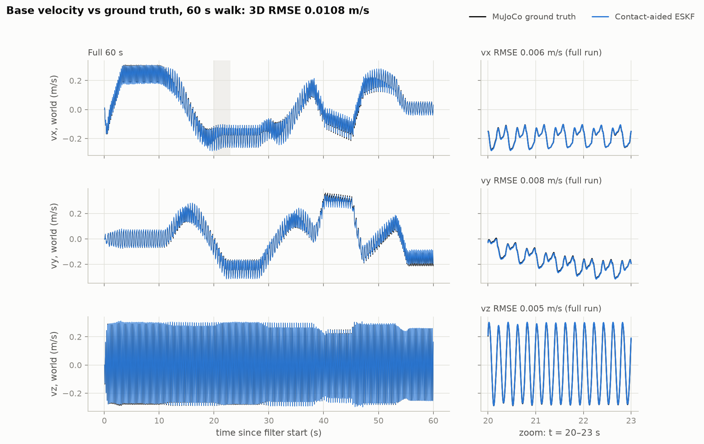
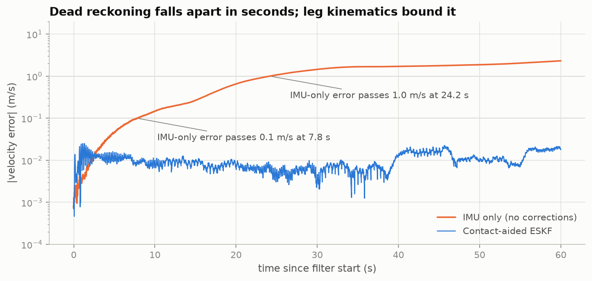
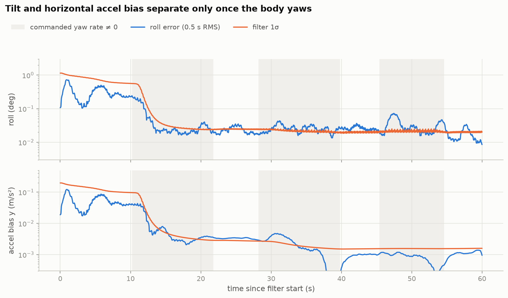
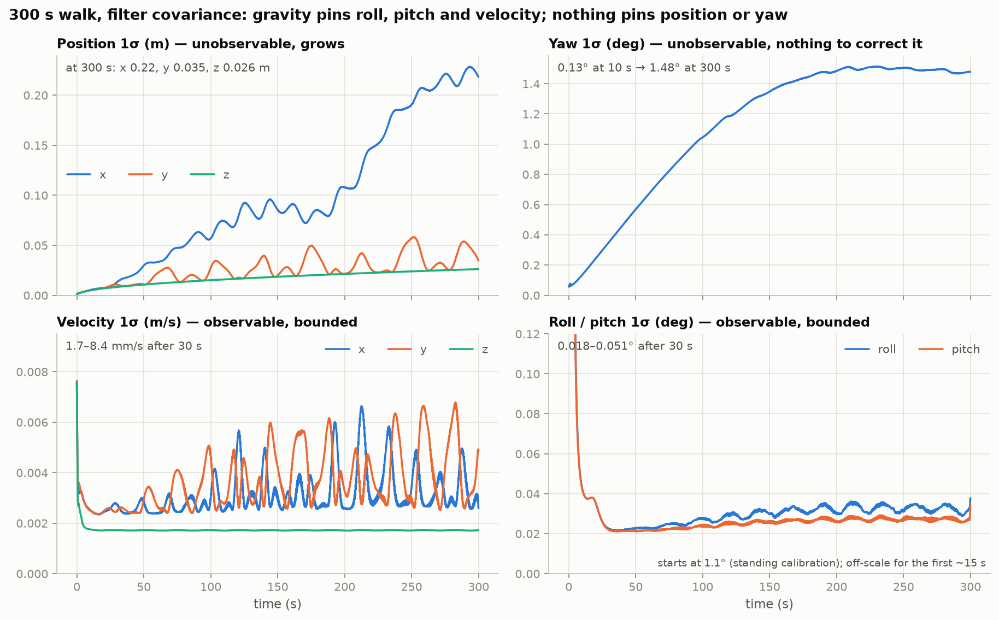
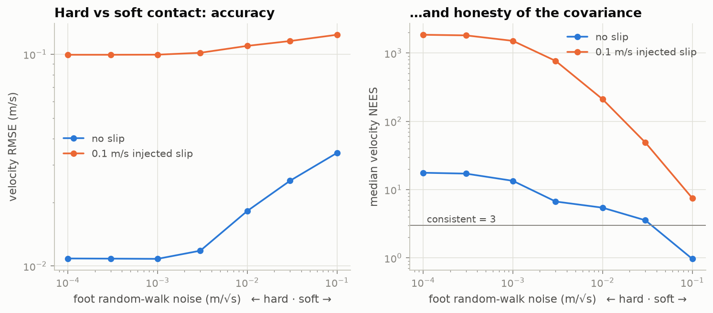
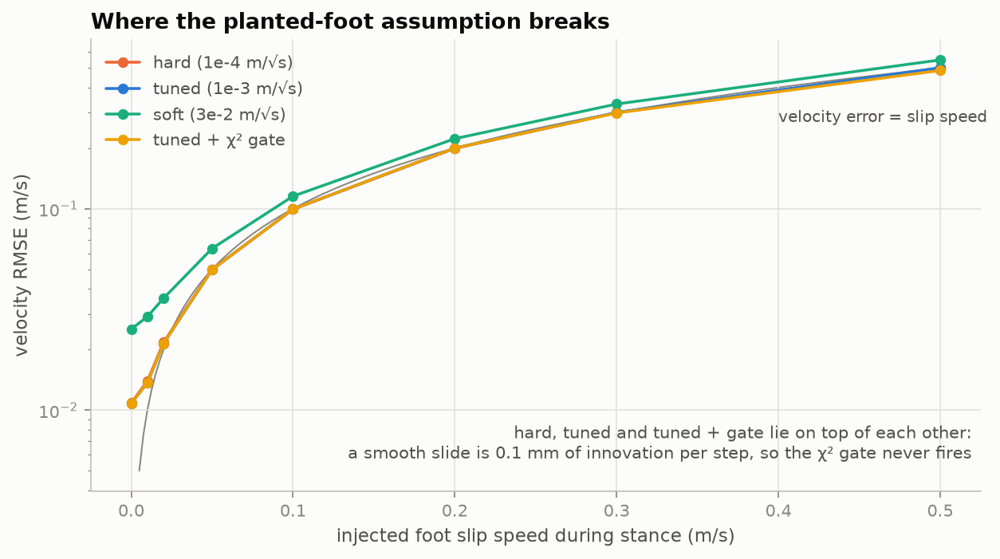
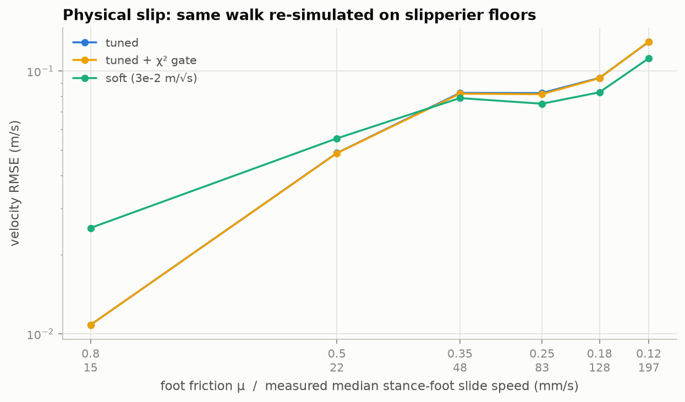
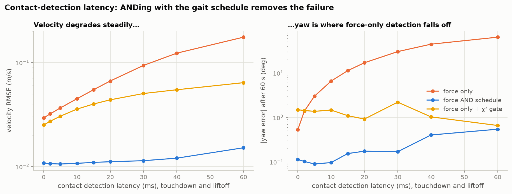

# Contact-aided error-state EKF for a walking quadruped

Estimates the base velocity, attitude and IMU biases of a simulated Unitree Go1 by fusing a
BMI088-class IMU at 1 kHz with leg kinematics. It includes a Python reference and a C++/Eigen
implementation that agree to 1e-13, a GoogleTest suite, a 1 kHz real-time loop benchmark, and five
experiments that break the filter on purpose to find where it stops working.

This is written as an engineering note: what the filter assumes, where it holds, where it doesn't,
and what's next. The bugs found along the way are in [`DEBUG_LOG.md`](DEBUG_LOG.md).



## Every number, and where it comes from

| Quantity | Value | Regenerate | Evidence |
|---|---|---|---|
| Base velocity RMSE, world frame, 3D, 60 s walk, **mean of 10 sensor-noise seeds** | **0.0128 m/s** (± 0.0019; range 0.0108–0.0162) | `make reproduce` | [`results/logs/reproduce.log`](results/logs/reproduce.log), [`metrics.json`](results/metrics.json) → `monte_carlo` |
| Same walk, sensor seed 0 (the run every plot shows; best of the ten) | 0.0108 m/s | `make reproduce` | `metrics.json` → `headline`, [velocity plot](results/figures/velocity_tracking.png) |
| IMU-only dead reckoning, same walk | 1.38 m/s RMSE; 68.9 m final position error after 13.1 m walked | `make reproduce` | [drift plot](results/figures/imu_only_drift.png), [trajectory](results/figures/trajectory_xy.png) |
| IMU-only velocity error passes 0.1 m/s | 7.8 s | `make reproduce` | `metrics.json` → `imu_only.t_vel_err_gt_0.1` |
| Estimator rate | 1 kHz: one predict per IMU sample, one kinematic update per sample | `make timing` | [`results/timing.json`](results/timing.json), [`logs/timing.log`](results/logs/timing.log) |
| C++ filter step, 1 kHz real-time loop | p50 18 µs, p99 60 µs (of a 1000 µs budget) | `make timing` | [timing histogram](results/figures/timing_histogram.png) |
| Deadline misses at 1 kHz, non-RT cloud VM | 0.13–0.18 % over 3 × 60 s runs (host stalls, not filter compute) | `make timing` | `timing.json` → `all_runs` |
| Python vs C++ on the same 60 s log | max \|Δp\| 1.4e-13 m, \|Δv\| 3.3e-13 m/s | `make reproduce`, `make test` | `metrics.json` → `parity_python_vs_cpp` |
| Unobservable directions, numerically | exactly 4 (3 translations + yaw) in all 30 windows tested | `make observability` | [`results/observability.json`](results/observability.json) |

Everything is deterministic except the timing (it depends on the host). `make claims` compares every number the
résumé and portfolio page state about this project against these files and exits non-zero on a mismatch.

**Metric definition, fixed before the first run:** velocity RMSE = √(mean‖v̂ − v‖²) over every 1 kHz sample of
the 60 s after a 2 s standing calibration, world frame, all three axes, sensor-noise seed 0. Seed 0 was
fixed as the headline before the other nine seeds were run. It turned out to be the best of the ten, so
the résumé quotes the 10-seed mean. The walk includes forward walking, turns both ways, a side-step and a stop. The contact-model parameters were chosen on
a *different* walk (see [How the numbers were chosen](#how-the-numbers-were-chosen)).

## Build and run

Tested on Ubuntu 24.04: GCC 13.3, CMake 3.28, Eigen 3.4, GoogleTest 1.14, Python 3.11, MuJoCo 3.14.

```bash
sudo apt install build-essential cmake libeigen3-dev libgtest-dev   # CMake fetches GoogleTest if it's missing
python3 -m pip install -r requirements.txt

make build test     # 0 warnings under -Wall -Wextra -Wpedantic; 26 C++ tests, 23 Python tests
make data           # ~2 min  simulate the walks, synthesize IMU/encoder streams
make reproduce      # ~3 min  headline numbers, RMSE table, figures, run log
make claims         #         résumé numbers vs results/*.json
make all            # ~27 min everything from scratch on 4 cores (tuning grid and experiments dominate)
```

## The setup

**Robot and ground truth.** Unitree Go1 from MuJoCo Menagerie (the same model MuJoCo Playground uses), physics-only
copy in [`models/go1`](models/go1), simulated in MuJoCo at 1 kHz. Ground truth is the trunk pose and velocity
from the simulator, recorded on the same step as the sensor sample (see DEBUG_LOG #1, #5, #6 for why that
alignment took three attempts).

**Walking.** A model-based trot controller ([`gait.py`](python/qeskf/gait.py)): phase clock, 0.4 s period,
60 % duty, ground-speed-matched swing, analytic leg IK, Menagerie's position servos. It reads ground truth;
the estimator never does. See [Deviations from the plan](#deviations-from-the-plan) for why this isn't a
Playground PPO policy.

**Sensors** ([`imu_model.py`](python/qeskf/imu_model.py)):
* IMU at the trunk origin, 1 kHz, 16-bit, ±6 g / ±1000 °/s, saturation and quantization.
* White noise at the BMI088 noise densities. Bias = turn-on offset + random walk (numbers and sources below).
* Joint encoders quantized at 14 bits (0.022°).
* Contact from simulated foot normal force > 5 N (a stand-in for a force-sensing foot or a torque-based estimate).

## The filter

### Frames, and where gravity comes out

* World: z up, g_w = (0, 0, −9.80665) m/s².
* Body = trunk = IMU frame (the Go1 IMU site sits at the trunk origin with identity rotation, so there's no lever arm).
* q_wb: Hamilton quaternion (w, x, y, z) mapping body vectors into world, same convention as MuJoCo.
* Attitude error is local: R_true = R̂·Exp(δθ), with δθ in the body frame.

The accelerometer measures **specific force in the body frame**: f = Rᵀ(a_w − g_w) + b_a + n_a. At rest
it reads +9.81 m/s² on z. Gravity is never subtracted in the body frame. The filter rotates the
bias-corrected specific force into the world frame and adds g_w there: **a_w = R(f − b_a) + g_w**. Done
this way, a tilt error shows up as a horizontal acceleration error of g·δθ, which is what makes roll and
pitch observable (below).

### State

Nominal: p, v (world), q_wb, b_a, b_g, and d_i, the world position of each foot currently in contact.
Error state: δx = (δp, δv, δθ, δb_a, δb_g, δd₁…δd_m), dimension 15 + 3m with m ∈ {0,…,4}.

**Why error-state instead of a direct EKF on the quaternion.** A unit quaternion uses 4 numbers for 3 degrees of
freedom. A covariance over (q_w, q_x, q_y, q_z) is singular along the unit-norm constraint, or, if you add
noise to make it full rank, it describes perturbations that aren't rotations. The error state carries a
minimal 3-vector δθ, so P stays full rank and positive definite. δθ also stays near zero, where
the small-angle linearization is accurate, and after each update it's folded into q and reset (reset
Jacobian G = I − ½[δθ]×).

### Propagation, every IMU sample

```
p ← p + v·dt + ½·a_w·dt²       a_w = R(f − b_a) + g_w
v ← v + a_w·dt
q ← q ⊗ Exp((ω − b_g)·dt)
P ← F P Fᵀ + Q
```
F is the exact Jacobian of those three lines on the manifold: δv ← δv − R[f − b_a]×δθ·dt − R·δb_a·dt,
δθ ← Exp(−ω̄·dt)δθ − J_r(ω̄·dt)·δb_g·dt, and so on (full list in [`eskf.py`](python/qeskf/eskf.py)). Every
block is checked against central finite differences to 1e-8 in both languages. In C++, `predict` exploits
F = blkdiag(F_core, I), updating the 15×15 core and the core-foot cross terms but never the foot-foot block.
That's O(15²·n) instead of O(n³), and the parity test holds it equal to the dense Python version.

### Kinematic update, every sample, for every foot in contact

```
z_i = FK_i(q_enc)              measured foot position, body frame
h_i = Rᵀ(d_i − p)              predicted
H_i = [ −Rᵀ, 0, [h_i]×, 0, 0, …, Rᵀ (at foot i), … ]
R_i = J_q·(Δ²/12)·J_qᵀ + σ_kin²·I     encoder quantization (uniform, step Δ) + model error
```
The update uses the Joseph form. With the optional χ² gate on, each foot's 3-dof innovation is gated
individually (see E2/E4 for when that helps).

### Touchdown and liftoff

* **Touchdown** (contact seen for more than 10 ms): **augment**. d_new = p + R·FK(q). The new rows of P
  come from the exact Jacobian J = [I, 0, −R[FK]×, 0, 0, …]:
  `P ← [[P, P Jᵀ], [J P, J P Jᵀ + R R_kin Rᵀ]]`.
  The foot is *not* also updated with the same z on that step, because that would count one measurement twice.
* **While planted:** d_i follows a random walk with σ_foot. σ_foot → 0 is a hard "the foot does not move"
  constraint; larger is a soft contact that tolerates slip and rolling. E1 measures the trade.
* **Liftoff:** **marginalize**, deleting the foot's three rows and columns. For a Gaussian that is the exact marginal.
* **Contact detection:** force > 5 N **and** the gait planner's stance window, ended 5 ms before
  scheduled liftoff. The planner knows its schedule in advance, so this is causal on a real robot. Why it
  ends early: DEBUG_LOG #4. Why the schedule is in there at all: E4.

### Process noise: every number in Q and where it came from

This is the part tutorials skip (`Q = np.eye(15) * 0.01`). Here, every IMU term comes from the sensor's
documentation, converted with one convention used by both the simulator and the filter.

| Term | Documented value | In the filter | Source |
|---|---|---|---|
| Gyro white noise N_g | 0.014 °/s/√Hz | 2.44e-4 rad/s/√Hz → 7.7e-3 rad/s per 1 kHz sample | BMI088 data sheet (BST-BMI088-DS001) |
| Accel white noise N_a | 175 µg/√Hz | 1.72e-3 m/s²/√Hz → 0.054 m/s² per sample | BMI088 data sheet / product page |
| Gyro bias instability | < 2 °/h | random walk K_g = 1.68e-6 rad/s²/√Hz | BMI088 **product flyer**. The data sheet doesn't give one. |
| Accel bias instability | not published | random walk K_a = 1.70e-4 m/s³/√Hz | **assumption**: 100 µg, typical consumer MEMS |
| Gyro turn-on offset | ±1 °/s | drawn per run in the sim; the filter starts from a 1.5 s static calibration | BMI088 data sheet |
| Accel turn-on offset | ±20 mg | drawn per run (σ = 0.196 m/s²); in P0, correlated with tilt (below) | BMI088 data sheet |
| Encoder | 14 bit | Δ = 3.8e-4 rad, variance Δ²/12 | AS5047P-class; the placement on the joint output is an assumption |
| Foot random walk σ_foot | — | 1e-3 m/√s | tuned on the tuning walk |
| Kinematic model error σ_kin | — | 3 mm | tuned on the tuning walk |

`Q_d = diag(0, N_a²·dt·I, N_g²·dt·I, K_a²·dt·I, K_g²·dt·I, σ_foot²·dt·I, …)`

* **White noise: multiply by √f_s, not f_s.** A noise density N (units/√Hz) becomes a per-sample standard
  deviation N·√f_s. The simulator draws exactly that, and the filter's N²·dt is the same quantity seen
  from the integral side. The sensor's internal low-pass filter lowers high-frequency noise, but drift is
  driven by the low-frequency power spectral density (N²), so this is the right number for Q.
* **Bias instability is not a random walk.** It's the flicker floor of the Allan deviation. The usual
  Kalman stand-in is a random walk whose Allan deviation, K·√(τ/3), equals the bias-instability value B at
  some τ. Here τ = 100 s, so K = B·√(3/τ). That under-states drift below 100 s and over-states it above.
* **Tilt and horizontal accel bias start correlated.** At rest, levelling absorbs b_a,xy into the tilt
  estimate (δθ_x = −δb_y/g, δθ_y = δb_x/g). P0 encodes that correlation instead of pretending the two are
  independent ([`initial_covariance`](python/qeskf/eskf.py)).
* **Not yet verified:** the build sandbox couldn't download the Bosch PDF, so the values above were
  checked against Bosch's product-page and flyer figures and distributor listings, not read from the data-sheet
  tables. Open BST-BMI088-DS001 Table 1 and Table 2 and confirm them before quoting them anywhere.
* **Optimistic by construction:** the simulated IMU is generated from the same noise model the filter assumes.
  E5 shows what happens when reality has something the model doesn't (warm-up drift).

What the datasheet-derived Q buys, same walk and same everything else (E5):

| Q | Velocity RMSE | Tilt RMSE after t = 12 s | Yaw error at 60 s | Velocity NEES (3 = consistent) |
|---|---:|---:|---:|---:|
| From the data sheet | 0.0108 m/s | 0.034° | +0.11° | 13 |
| "Tutorial" Q = 0.01·I per step | 0.47 m/s | 103° (attitude lost) | +10.4° | 0.8 |
| Data sheet ÷ 10 (overconfident) | 0.0123 m/s | 0.039° | +1.48° | 88 |
| Data sheet × 10 (timid) | 0.0170 m/s | 0.21° | −2.33° | 4.5 |
| Data sheet, but the IMU has a 5 K warm-up drift (0.015 °/s/K) | 0.0122 m/s | 0.043° | −2.36° | 13 |

The last row is the honest one. A real BMI088 warming up by 5 K moves its gyro bias by 0.075 °/s, far more
than the < 2 °/h bias instability that Q was built from, and yaw pays for it.

## Results

60 s walk, 13.1 m, sensor seed 0 ([`results/rmse_table.md`](results/rmse_table.md) is regenerated by `make reproduce`):

| State (RMSE) | IMU-only | Contact-aided | Contact-aided vs IMU-only |
|---|---:|---:|---:|
| Velocity, world 3D (m/s) | 1.38 | 0.0108 | 128× better |
| Velocity x / y / z, world (m/s) | 1.28 / 0.514 / 0.0125 | 0.0055 / 0.0079 / 0.0049 | |
| Velocity, body 3D (m/s) | 1.38 | 0.0102 | 135× better |
| Roll (deg) | 0.226 | 0.144 | 1.6× better |
| Pitch (deg) | 0.195 | 0.564 | **2.9× worse** |
| Yaw (deg) | 0.428 | 0.279 | 1.5× better |
| Position x / y / z (m) | 28.6 / 10.7 / 0.37 | 0.046 / 0.026 / 0.068 | |
| Accel bias x (m/s²) | 0.025 | 0.096 | **3.8× worse** |
| Gyro bias x / y / z (°/s) | 0.0071 / 0.0116 / 0.0103 | 0.0043 / 0.0037 / 0.0081 | |

Final position error: 68.9 m IMU-only; 0.15 m contact-aided (0.13 m horizontal, 1.0 % of distance walked).



**Dead reckoning.** The velocity error passes 0.1 m/s at 7.8 s and 1 m/s at 24 s, growing at 0.015 m/s per s
over the first 10 s. The standing calibration gives it a fair start (bias from the mean gyro, tilt from
levelling). Almost all of the growth is gyro noise and bias turning into tilt error, which leaks gravity
into horizontal acceleration.

**The two rows that got worse.** Over the full window, contact-aided pitch and accel-x bias are worse than
doing nothing. They're a transient: pitch RMSE is 1.7° for 0–5 s and 0.78° for 5–12 s, then 0.02–0.08°
after the first turn (`metrics.json` → `tilt_by_segment`), roughly an order of magnitude better than
IMU-only levelling (0.195°). The next section explains why.



**Consistency.** Median velocity NEES is 13 against 3 for a consistent filter, so the covariance is about
2× too small in σ. That's the price of the near-hard contact the tuning picked (E1).

## Observability

**Claim:** with IMU and leg kinematics only, velocity, roll, pitch and both biases are observable. Absolute
position (3 directions) and yaw (1 direction) are not.

**Derivation.** Linearized error dynamics and measurement:

```
δṗ = δv                          δḃ_a = n_ba,  δḃ_g = n_bg,  δḋ_i = n_d
δv̇ = −R[f̄]×δθ − R·δb_a − R·n_a
δθ̇ = −[ω̄]×δθ − δb_g − n_g
δz_i = −Rᵀδp + [h_i]×δθ + Rᵀδd_i
```

A direction N is unobservable if the measurement can't see it (H·N = 0) and the dynamics carry it into
itself. Two families qualify:

* **Translation:** δp = δd_i = e_j, everything else 0. Moving the body and all planted feet together changes
  no FK vector, and δṗ = δv = 0 keeps it that way. (3 directions)
* **Rotation about gravity:** δp = [e_z]×p, δv = [e_z]×v, δθ = Rᵀe_z, δd_i = [e_z]×d_i.
  Measurement: −Rᵀ(e_z×p) + h×Rᵀe_z + Rᵀ(e_z×d) = Rᵀ(e_z×(d−p)) − Rᵀ(e_z×(d−p)) = 0.
  Dynamics: d/dt([e_z]×v) = e_z×(R·f̄ + g_w) = e_z×R·f̄ **because e_z × g_w = 0**, which is exactly what
  the δv̇ row gives for δθ = Rᵀe_z. (1 direction)

Repeat that with a horizontal axis e and the dynamics row gains e × g_w ≠ 0. A rotated copy of the
trajectory would need a different accelerometer reading, so the rotation is visible. **That's the whole
answer to "why is yaw unobservable but roll and pitch aren't":** gravity is the only absolute direction any of
these sensors can see. Rotating everything about gravity changes no measurement; rotating about any other
axis tips gravity, and the accelerometer sees it.

Velocity is observable once attitude is: with foot i planted, ż_i = −ω × z_i − Rᵀv, so v = −R(ż_i + ω × z_i).
Gyro bias enters the same expression through ω. Accel bias is only separable from tilt when the body changes
orientation, and that's the weak direction below.

**Numerical check** ([`observability.py`](python/qeskf/observability.py)): linearize along a trajectory
that satisfies the filter's own discrete dynamics, stack O = [H₀; H₁F₀; H₂F₁F₀; …] over 100-sample
stance windows, and take the SVD.
* All 30 windows of the 300 s walk have **exactly 4** singular values at numerical zero (≤ 1e-16 relative), and
  the 4 analytic directions satisfy ‖O·N‖/(‖O‖‖N‖) ≤ 2e-16.
* The next-weakest directions are (δb_a,x, δθ_y) and (δb_a,y, δθ_x), with the angle-to-bias ratio 0.10 ≈ 1/g.
  That's tilt against horizontal accel bias, the ambiguity the pitch transient above comes from. It's
  observable, but only through orientation changes, and walking on flat ground mostly provides yaw.

**Over a long walk** (300 s, 51 m) the filter's own covariance shows the split:



Position σ grows overall. Its x/y split swings as the robot turns, because heading uncertainty spreads
position sideways to the direction of travel. Velocity σ stays at 1.7–8.4 mm/s and roll/pitch σ at
0.02–0.05°. Yaw σ grows fastest early on (0.13° at 10 s → 1.48° at 200 s), while gyro-z bias is still
uncertain. Once the kinematics pin the bias down, only the BMI088's angle random walk is left (about 0.24°
over 300 s), so the curve flattens near 1.5°. Nothing measures heading, so nothing brings it back down.
Actual errors after 300 s: yaw −2.8° (1.9σ), position 0.80 m (1.6 % of the distance).

**Does the EKF stay honest about yaw?** A standard EKF linearizes at its changing estimate, and that can
make an unobservable direction look slightly observable, the classic inconsistency that FEJ, OC-EKF and
invariant EKFs fix. Measured here: the measurement Jacobian respects the yaw symmetry exactly
(|H·N| = 4e-16). The information along the yaw direction falls steadily over the run, and the spurious
rises sum to 2 % of the starting value. Small on this walk; it's the first thing to recheck on longer or
more aggressive runs.

## Breaking it on purpose

Baseline: tuned filter, headline walk, seed 0. `make experiments` regenerates all of these
([`results/experiments.json`](results/experiments.json)).

### E1. Hard vs soft contact: going the other way, and it was worse

A "planted" foot-sphere centre actually moves during stance (a 23 mm sphere rolls; the soft floor compresses):
2.7 mm horizontally and 5.0 mm vertically per 0.14 s stance, the equivalent of a 6.6 mm/√s and 14 mm/√s random walk
(`metrics.json` → `foot_motion_in_stance`). So the physically motivated choice is a soft contact, σ_foot ≈ 0.01 m/√s.
Swept from hard to soft:



* **Clean floor:** RMSE is flat at 0.011 m/s from 1e-4 to 1e-3, then rises: 0.018 m/s at 0.01 (the "physical"
  value) and 0.034 m/s at 0.1. Treating the foot as fixed wins. The foot's motion is small and mostly systematic, and a
  random walk can't model it well; softening mostly throws away information.
* **What soft buys is honesty:** NEES drops from 17 (hard) to 1.0 (0.1). The hard filter is more accurate but
  claims about 2× more precision than it has (σ too small by √(NEES/3)).
* **Under 0.1 m/s slip, soft doesn't help accuracy:** every setting lands at ≈ 0.10–0.12 m/s. Soft only makes
  the filter *know* it's wrong (NEES 7.5 vs 1852).

The tuning rule (lowest RMSE) picked 1e-3. The runner-up (3e-3) was 3 % worse on RMSE with NEES 3.0, and
if the covariance feeds a planner, that's the one to use.

### E2. Slip: where the planted-foot assumption breaks

A synthetic slide at a set speed during every stance, pointing backwards (a foot skating on ice while the
body pushes forward):



* The velocity error tracks the slip speed one to one. At 5 cm/s of slip the RMSE is 0.050 m/s; at 0.3 m/s it's
  0.30 m/s. The filter can't tell "the foot slid" from "the body moved", and the IMU only disagrees slowly.
* **Boundary: about 2 cm/s of foot slip doubles the velocity error** (0.0108 → 0.021 m/s).
* **The χ² gate never fires.** A smooth slide is 0.1 mm of new innovation per 1 ms step, and each step the
  filter absorbs it into velocity. Per-sample gating catches jumps, not ramps. Slip detection needs a
  windowed test (kinematic velocity vs IMU-predicted velocity over the stance) or a different sensor.

### E3. Physical slip: the same walk on slipperier floors

Re-simulated with lower foot friction (the controller keeps walking down to μ = 0.12). Tick labels show the
measured median stance-foot slide speed.



| μ | Median stance-foot slide | Velocity RMSE (tuned) | Soft contact (3e-2) |
|---:|---:|---:|---:|
| 0.8 (default) | 15 mm/s | 0.011 m/s | 0.025 m/s |
| 0.5 | 22 mm/s | 0.049 m/s | 0.055 m/s |
| 0.35 | 48 mm/s | 0.083 m/s | 0.079 m/s |
| 0.12 | 197 mm/s | 0.129 m/s | 0.112 m/s |

At μ = 0.5 the error is already 4.5× the baseline. From μ = 0.35 down, soft contact wins slightly; above that it loses.

### E4. Contact-detection latency: where it falls apart

Touchdown and liftoff detection delayed by 0–60 ms, for three detectors:



* **Force-only detection** is already 2.7× worse at zero latency (0.029 m/s). Force stays above threshold
  while the foot is being unloaded and dragged at the end of stance. Latency then makes it steadily worse
  in velocity, but the real failure is **yaw**: 0.5° at 0 ms, 3° at 5 ms, 6.6° at 10 ms, 17° at 20 ms, 64° at
  60 ms. A late liftoff means the filter believes a foot is planted while it swings forward, and the
  rotation it infers from that is wrong.
* **ANDing with the gait schedule removes the cliff:** 0.0108 → 0.0151 m/s and < 0.6° of yaw even at 60 ms,
  because the scheduled liftoff bounds how late "still in contact" can be.
* The χ² gate helps the force-only detector here (60 ms: 0.064 m/s and 0.7° of yaw), because a swinging foot
  is a jump in the residual, not a ramp.

### E5. Process noise

Table above, in [Process noise](#process-noise-every-number-in-q-and-where-it-came-from).

## How the numbers were chosen

* **IMU noise:** the data sheet and product flyer only (table above). Never tuned.
* **Contact model** (σ_foot, σ_kin, settle time, liftoff anticipation): a 150-point grid on a **separate
  120 s tuning walk** (different path, sensor seed 100). Rule fixed in advance: lowest world-frame velocity RMSE.
  Result: σ_foot 1e-3 m/√s, σ_kin 3 mm, settle 10 ms, liftoff 5 ms early. The headline walk is never loaded by
  [`tune.py`](python/scripts/tune.py); the full grid is in [`results/tuning_grid.json`](results/tuning_grid.json).
* **Headline seed:** 0, fixed before running. The 10-seed spread (0.0108–0.0162 m/s) shows seed 0 happens to be the
  best of the ten. The mean, 0.0128 m/s, is the fairer summary.

## Assumptions, and where this is valid

* **Flat, rigid ground; point feet.** The foot sphere's centre is treated as a fixed point in stance. The
  model tolerates rolling of a 23 mm sphere and a few mm of floor compression (E1). Stairs, gravel and mud
  are untested.
* **Contact is known well.** Force threshold plus gait schedule, from a simulator. A real robot estimates
  contact from joint torques or foot sensors, with more latency and false positives, and E4 shows the
  filter depends heavily on that.
* **Kinematics are exact.** Link lengths are known perfectly, there's no backlash, and the only encoder error
  is quantization. Real legs flex.
* **IMU:** white noise plus a random-walk bias at the data-sheet levels, no scale-factor or cross-axis error,
  no temperature effects in the headline run, and a perfect lever arm (zero). Accel sampled at 1 kHz. The
  real BMI088 accel runs at 1600 or 800 Hz and would be resampled.
* **Commanded speed 0.2–0.45 m/s, trot.** Nothing faster, and no flight phases. Pronking or running with all
  four feet off the ground leaves only the IMU for those phases.

## Limitations (honestly)

This is a simulator result, and it's optimistic in ways that matter. The IMU noise comes from the same model
the filter assumes. Contact comes from simulated forces. The kinematics are exact. The floor is flat. The
0.011–0.013 m/s here shouldn't be compared with numbers from hardware, where contact detection, leg flex,
IMU calibration and terrain all add error that this simulation doesn't have. The filter is also overconfident (velocity NEES 13), its
pitch and accel-x bias are unreliable until the robot has turned, and it can't detect a smooth foot slide
at all (E2): it reports the slide as body motion.

## Next steps

1. **Slip detection over a window**, not per sample: compare the kinematic velocity against IMU-predicted
   velocity across each stance (E2 says per-sample χ² can't see a ramp).
2. **A consistency-preserving formulation**: first-estimates Jacobians or an invariant EKF (Hartley et al.
   2020), and re-measure the yaw-information drift on a 30-minute walk.
3. **A learned or torque-based contact estimator** in place of simulated force, then rerun E4 with its
   real latency distribution.
4. **A Playground PPO policy on a GPU** instead of the scripted trot, for gaits that aren't so regular.
5. **Temperature**: add a bias-temperature state or at least model the warm-up (E5 shows it dominates yaw).

## Deviations from the plan

* **No trained Playground policy.** The plan called for a MuJoCo Playground (MJX) Go1 policy. Playground was
  installed and its Go1 joystick environment benchmarked on the build machine (4 CPU cores, no GPU): about
  1.6k environment steps/s at 1024 parallel environments, which puts Playground's 200M-step Go1 recipe at
  about 35 hours. The estimator only needs a robot that walks with ground truth, so a scripted trot on the
  same Go1 model does the job. Swapping in a trained policy only changes `sim.py`.
* **Native MuJoCo, not MJX.** The IMU needs 1 kHz physics. Playground's Go1 runs at 250 Hz physics / 50 Hz
  control with a 1-iteration Euler solver, which is tuned for training throughput.
* **Model:** Menagerie's `go1.xml` (full collision set) rather than Playground's feet-only variant.

## Repo layout

```
models/go1/            Go1 physics model (from MuJoCo Menagerie, BSD-3) and the 1 kHz scene
python/qeskf/          sim, gait, IMU model, kinematics, ESKF (reference), observability, pipeline
python/scripts/        generate_data, tune, reproduce, observability, experiments, timing,
                       check_claims, debug_repro, make_parity_fixture
python/tests/          pytest: Jacobians vs finite differences, SPD, quaternion norm, sim/IMU alignment,
                       null space
cpp/include, cpp/src   C++17/Eigen ESKF, kinematics, SO(3)
cpp/apps               qeskf_replay (offline), qeskf_bench_loop (1 kHz real-time loop)
cpp/tests              GoogleTest: Jacobians vs finite differences, invariants, Python parity fixture
results/               metrics.json, rmse_table.md, observability.json, experiments.json, timing.json,
                       tuned_params.json, logs/, figures/ (every PNG has a CSV of its plotted data)
claims.json            every number the résumé states, mapped to the file and key that back it
DEBUG_LOG.md           what broke, what it looked like, what it actually was
```
